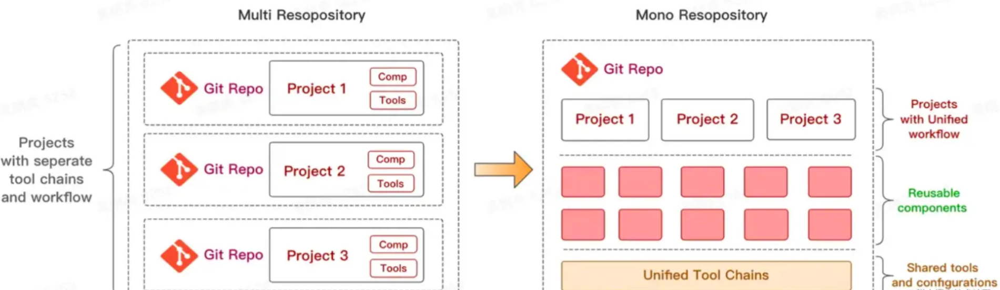
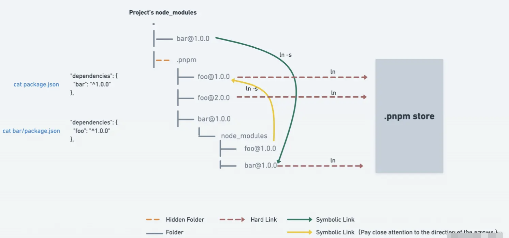

# pnpm monorepo 指南

## 初识 monorepo

### 🤔 什么是 monorepo?

monorepo 是一种将多个项目代码存储在一个仓库里的软件开发策略（"mono" 来源于希腊语 μόνος 意味**单个**的，而 "repo"，显而易见地，是 repository 的缩写）。
通常，一个monorepo仓库包含多个代码库（例如前端、后端），以及共用的库、组件与工具集。通过使用单一仓库，它能够使得代码的共享更加容易，并且可以更好地协调各个项目的发布和版本控制。此外，单一仓库还可以提高代码重用和测试效率，并且可以更加容易地维护跨项目的共用部分。

### ❓ 为什么选择 monorepo?

现有的 Git 托管代码策略主要有两种：multi-repo 与 mono-repo。



据本人主观臆测😂，目前大部分开源项目使用的是 multirepo 策略。
那么问题来了，我为什不选择更多人使用、更加成熟的 multirepo 策略而去选择 monorepo 策略呢？相较 multirepo，monorepo 有什么优势呢？🤔

优势主要有以下几点：

- **更简单的依赖管理与版本控制**。所有项目放在一个仓库当中，如果有依赖的代码变动，那么用到这个依赖的项目都会立马感知到。并且所有的项目都是使用最新的代码，不会出现其它项目版本更新不及时的情况。
- **更简单的代码复用**。由于所有的项目代码都集中于一个代码仓库，我们将很容易抽离出各个项目共用的业务组件或工具，可方便地进行可复用代码的共享与跨项目复用。
- **更简单的代码重构**。开发人员可访问项目的所有代码，可以很容易地明确代码影响范围，并且可以根据依赖关系对受影响的项目进行统一测试。这使得开发人员可以很容易地进行重构，而不会影响其他项目。
- **更简单的团队协作**。团队成员都可以查看项目整体代码，更好地理解变更对项目的影响，提升团队成员对项目的整体把控，有助于提升代码质量。

monorepo 优点有这么多，也并不意味着 monorepo 是万金油，它的缺点照样明显：

- **代码管理复杂性提高**。管理大型代码库的复杂性更高，细粒度的代码权限管理较multirepo更加困难。
- **构建成本增加**。项目越大，代码下载、构建和部署时间越长，公司级别的monorepo策略需要专门的工具支持。如 google、facebook 就将企业的大部分代码存储在一个代码库中，为此它们配备专门的人员和工具来保证代码的正常下载、构建与部属。
- **学习成本陡增**。不同于multirepo，monorepo策略即相关工具的使用需要重新学习，增加了学习成本。

既然 monorepo 的优缺点都很明显，那么*你能否采用 monorepo 策略管理代码*就取决于*你能否在享受它带来的提升的同时忍受与之俱来的种种不便*。

在种种限制之下，如何良好地使用 monorepo 管理代码？——**实践表明，将 monorepo 策略实践在【项目】级别是一个不错的选择**。这需要我们从逻辑上确定项目与项目之间的关联性，然后把相关联的项目整合在同一个仓库下（通常情况下，我们不会有太多相互关联的项目），抽离可复用逻辑、组件与工具链。

一个适合 monorepo 策略的【项目】或多或少的存在以下特征：

- 项目规模较大，如包括多个子项目、子模块或库
- 子项目、子模块或库之间存在依赖关系
- 各项目有统一的构建与发布/部属流程
- 代码复用程度高、代码可拆分
- 开放的代码访问原则，团队成员频繁协作

对应的，我们可以发现确实存在许多类型的项目适合 monorepo 策略：

- 👉 微前端项目：包含一个底座与多个子应用以及一些可复用组件、方法
- 👉 模板 + sdk：模板依赖sdk，模板提供给外部，sdk 通过npm 包的形式分发
- 👉 开源库项目：如 vue，babel、midway、element-plus、verdaccio 等
- 👉 web 项目：前端js、后端node
- ...

### monorepo 最佳实践

monorepo 应该在代码共享方面开放、灵活且透明的前提下，促进多项目开发的协作和可维护性，同时保持版本控制、测试和构建等方面的一致性。以下为最佳实践：

- 💡模块化设计： Monorepo内部的代码库和组件应该被清晰地组织和模块化，这有助于代码重用和更好的可维护性。
- 💡统一的测试、构建和部署流程：由于Monorepo包含多个代码库，每个库都有自己的构建和测试工作流，因此必须使用统一的构建过程和测试框架。这将确保每个库都可以方便地构建，集成和测试，并且容易维护。
- 💡开放的代码访问原则：在Monorepo中，所有团队成员都可以看到整个仓库，可以同时开发多个项目。
- 💡良好的依赖管理与版本控制策略：Monorepo需要定期的版本控制，这涉及到版本号的管理、依赖库的更新以及发布和交付流程。好的版本控制策略可以确保每个库和组件的版本都被跟踪，从而使整个系统更可靠和稳定。

## pnpm

### what's pnpm?

[pnpm](https://pnpm.io/zh/motivation) 是一个node.js包管理工具，相比传统的包管理工具（npm、yarn）更加快速且节省空间。pnpm 有两个主要的特性：

- pnpm 使用全局 store 存储，依赖安装时会将包下载至全局 store，然后通过软链接（符号链接）和硬链接来组织 node_modules 目录结构。

  1. 使用硬链接将全局store链接到项目的store（node_modules/.pnpm）
  2. [项目 node_modules 结构依赖软链接（符号链接）](https://pnpm.io/zh/symlinked-node-modules-structure)
     

  > 这种布局乍一看可能很奇怪，但它与 Node 的模块解析算法完全兼容。解析模块时，Node 会从符号链接、硬链接解析到其实际位置。如此布局的一大好处是只有真正在依赖中的包才能访问。

- 内置对 monorepo 的支持，即 [pnpm workspaces](https://pnpm.io/zh/workspaces)，并解决了部分多package管理的问题（如重复安装、幽灵依赖、依赖分身等）
  > 重复安装：工作区内多包有同一依赖，但该依赖被安装多次
  > 幽灵依赖：npm3 以后，全部依赖被扁平化在根目录，由于node的递归查找，你可以访问任何其他package的依赖，以及以来的依赖。这将导致代码开发测试都没问题，发包或部署到线上之后发现缺少依赖。
  > 依赖分身：同一依赖的大量不同版本，随机出现在node_modules的目录下。

### why pnpm?

目前流行的 monorepo 工具有：

- git submodules
- lerna + yarn workspaces
- npm：从 7.x 开始支持worksapces
- [pnpm workspaces](https://pnpm.io/zh/workspaces)

目前，pnpm workspaces 是最简单可用的 monorepo 策略实践方案。

## 🛠️ 实践

本文的实践 demo 项目地址：<https://github.com/rankangkang/ts-monorepo-starter>

### 🔨 创建 workspace

```bash
mkdir demo && cd demo
pnpm init
```

将相关联的项目放置到workspace目录中，然后在 workspace 根目录创建 pnpm-workspace.yaml 文件，新增packages属性，同时 package.json 文件也新增 workspaces 属性。
假设 <a id="demo_struct">demo 项目结构</a>为：

```bash
mono
├── examples     # examples 目录，下为示例包
│   ├── xcompile     # 交叉依赖编译示例
│   └── ...
├── packages     # packages 目录，下为模块包
│   ├── cache    # cache 模块
│   ├── logger   # logger 模块
│   └── ...
├── package.json
├── pnpm-workspace.yaml
└── ...
```

则 `pnpm-workspace.yaml` 文件应该为：

```yaml
packages:
  - examples/*
  - packages/*
```

对应的 `package.json` 的 workspaces 配置应该为：

```json
{
  // ...
  "workspaces": ["examples/*", "packages/*"]
}
```

> 子项目的命名统一为 `@<scope-name>/<module-name>`，这是一种社区最佳实践。

### 🔨 统一配置

#### 📌 工具配置

每一个typescript项目都有其相应的配置，如 tsconfig、eslint、babel、commitlint、prettier、jest 等配置。遵循 DRY（Don't Repeat Yourself） 原则，我们应该尽量避免在子项目中放置重复的配置文件。幸运的是，许多工具（Typescript、eslint与babel）都提供了扩展功能来减少这样的重复。

所有项目通用的配置可直接在项目根目录配置，对所有项目生效；若某些子项目需要不同的配置，可将共有配置存放在workspace根目录，并在各个子项目中扩展这些通用配置。
如 tsconfig、eslint、babel 等可通过 `extends` 属性继承配置：

```json
{
  "extends": "../../tsconfig.setting.json", // 继承通用配置
  "compilerOptions": {
    // 编写项目独有的配置
    // ...
  }
  // ...
}
```

#### 📌 npm script 与 git hook

每一个子项目都可以拥有它的 npm script，当工作区中的项目逐渐增多时，如何批量管理、运行它们也成为了一件麻烦事。
对此，我们可以在各个子项目编写统一规范的脚本，如 start、build、clean、publish 等（也可配合 npm script hook 完成一些组合操作），


然后在工作区目录直接运行 `pnpm -r` 命令来批量运行子项目的脚本。

```bash
# 递归运行package.json中定义的 build 脚本
pnpm -r run build
```

也可通过 `pnpm -F` 或 `pnpm --filter` 来运行指定项目的脚本：

```bash
# 运行 logger 模块的 build 脚本
pnpm -F logger run build

# 运行除 logger 模块外的 build 脚本
pnpm -r -F !logger run build
```

最后，可配合 husky + lint-staged 为项目添加 git hooks 预设，在不同阶段对项目代码进行检查，避免不规范的代码提交。

```json
{
  "scripts": {
    "prepare": "husky install"
  }
}
```

### 🔨 编译与打包

在 monorepo 项目中如何打包主要取决于项目结构和打包方式。一般来说，monorepo 项目中的每个子项目都可以独立进行打包，也可以将所有子项目组合在一起，一起进行打包。以下是三种常见的打包方式：

1. 独立打包。每个子项目都可以独立打包成一个 npm 包，并发布到 registry。该方式适用于子项目具有独立的功能和用途，可以单独使用和维护的场景。每个子项目都需要独立设置打包工具和配置文件，比较灵活且易于维护。但是，这种方式可能会导致开发人员重复工作，因为需要在每个子项目中都进行打包、部署和发布等操作。
2. 统一打包。各子项目的打包方式相同，一般在工作区根目录编写配置统一的打包脚本，常见于各种开源项目，如 vue3，element-plus 等，难度较大。
3. 组合打包。将部分子项目组合在一起，一起进行打包成一个 NPM 包或者一个 JavaScript 应用程序。

- 适用于子项目之间存在较强的依赖关系，需要进行交叉依赖编译和组合的场景。
- 需要统一的构建脚本和配置文件，在打包前需要组合子项目，并进行交叉编译和优化等操作，通常配合webpack、rollup、gulp等专门的打包工具打包。
- 相对于独立打包更加复杂，需要更多的配置和工作。

具体的实现可以根据具体情况进行调整和优化，一般建议根据项目的需求和复杂度选择合适的打包方式。

#### 📌 typescript 交叉依赖编译

当 monorepo 的子项目间出现交叉依赖时，需要首先编译被依赖的项目，再编译目标项目，编译才能通过。每当修改被依赖的包后，都需要重新编译，十分繁琐。
对此，可通过配置 tsconfig 的 [`references`](https://link.juejin.cn/?target=https%3A%2F%2Fwww.tslang.cn%2Fdocs%2Fhandbook%2Fproject-references.html) 和 `composite` 属性来解决交叉依赖编译的问题，减少手动编译。

<!-- 还是此处的 <a href="#demo_struct">demo<a> 项目目录结构 -->

还是此处的 [demo](#🔨-创建-workspace) 项目目录结构。
其中 xcompile、cache、logger 均为 typescript 项目，xcompile 项目依赖 cache 与 logger 模块，现在要实现 编译 xcompile 项目时，先编译 cache 与 logger 模块的效果（交叉编译），需遵循以下步骤：

1. xcompile 项目下的 tsconfig.json 声明其依赖的模块：

   ```json
   {
     // ...
     "references": [{ "path": "../../packages/cache" }, { "path": "../../packages/logger" }]
   }
   ```

   同时，为了在子项目未编译时仍能正确的识别类型，需为子项目 tsconfig 配置 alias，指向其ts入口文件：

   ```json
   {
     "compilerOptions": {
       // ...
       "paths": {
         "@mono/logger": ["../../packages/logger/src"],
         "@mono/cache": ["../../packages/cache/src"]
       }
     }
   }
   ```

   此外，配置路径别名后，配合 ts-node 与 tsconfig-paths 插件可直接运行调试ts项目代码。

   ```bash
   npx ts-node -r tsconfig-paths/register src/index.ts
   ```

2. 被依赖项目开启 `composite` 配置。为子项目的 tsconfig.json 增加 `composite` 目录：

   ```json
   {
     "compilerOptions": {
       // ...
       "composite": true // 使用references 字段引入的配置文件需要设置 composite: true
     }
   }
   ```

3. 到xcompile目录下，执行以下脚本：

   ```bash
   npx tsc --build
   ```

   > 注意：必须添加 `--build` 标志，否则不会编译其依赖项。

#### 📌 打包

- 可使用 webpack/rollup/esbuild等打包工具打包；
- 通常情况不会选择对NodeJS 项目进行打包。在不打包的情况下，若需要对项目进行压缩，则需要保留node_modules软连接，否则子项目内的node_modules软链接将被还原，造成压缩包体积成倍增大。

  ```bash
  # -y 保留软连接
  zip -r -y output.zip *
  ```

- 若需要对NodeJS项目进行打包，可选择 ncc 工具进行打包。ncc 是一个类似于 gcc 的 NodeJS 编译打包工具，vercel 出品，基于webpack，可以0配置将NodeJS项目编译打包为单个JS文件（包括node_modules依赖）。

  ```bash
  ncc build src/index.ts -o app.js -t
  ```

## 🔨 发布与版本管理

在workspace中对包版本管理是一个非常复杂的工作，遗憾的是pnpm 没有提供内置的解决方案，一部分开源项目在自己的项目中自己实现了一套包版本的管理机制，比如 [Vue3](https://github.com/vuejs/core)、[Vite](https://github.com/vitejs/vite) 等。
好在 pnpm 推荐了了两个开源的版本控制工具：

- [changesets](https://github.com/changesets/changesets)
- rush

这里我们选择较为简单明了的 changesets 上手：

1. 配置
   将 changesets 安装到 workspace 根目录

   ```bash
   pnpm add -Dw @changesets/cli
   ```

   初始化 changeset

   ```bash
   pnpm changeset init
   ```

   如此，根目录将生成一个 `.changeset` 目录

2. 添加变更
   当完成一个版本的开发，需要生成新的变更日志时，可在工作空间根目录执行如下命令

   ```bash
   pnpm changeset
   ```

   选择合适的选项并回车确定，.changeset 目录中将生成记录变更记录的 md 文件，用于后续消费。

3. 发布变更
   在 workspace 根目录中执行如下命令

   ```bash
   # 根据 semver 规则提升版本，消耗 .changeset 中的记录文件，生成 changelog。
   pnpm  changeset version

   # 更新锁文件，重新构建包
   pnpm install

   # 提交更改到仓库

   # 发布
   pnpm changeset publish
   ```

   该操作将为工作目录中尚未发布操作的包执行发布操作，并生成 changelog。
   默认发包至 <https://registry.npmjs.org/>，若需更改发包仓库，可配置 `npm_config_registry` 环境变量。

   ```bash
   npm_config_registry=https://registry.npmmirror.com/ pnpm changeset publish
   ```

   或在 package.json 中配置 `publishConfig` 配置项

   ```json
   {
     // ...
     "publishConfig": {
       "registry": "https://r.cnpmjs.org"
     }
     // ...
   }
   ```

若您的项目有大量的包/版本需要发布，可配置CI 简化发包流程。

- [基于 Monorepo、Lerna、gitlab 的 CI/CD](https://juejin.cn/post/6915691445835956237)
- [Changesets: 流行的 monorepo 场景发包工具](https://juejin.cn/post/7024827345059971080)

## 📜 参考文档

- [All in one：项目级 monorepo 策略最佳实践 - 知乎 (zhihu.com)](https://zhuanlan.zhihu.com/p/348898271)
- [Monorepo 原理浅探 - 掘金 (juejin.cn)](https://juejin.cn/post/7025471465482895397)
- [开源项目都在用 monorepo，但是你知道居然有那么多坑么？ - 知乎 (zhihu.com)](https://zhuanlan.zhihu.com/p/364109385)
- [Monorepo---让跨项目合作像搭积木一样简单 - 知乎 (zhihu.com)](https://zhuanlan.zhihu.com/p/513171061)
- [为什么推荐使用pnpm - 知乎 (zhihu.com)](https://zhuanlan.zhihu.com/p/419399115)
- [[译]用 PNPM Workspaces 替换 Lerna + Yarn - 掘金 (juejin.cn)](https://juejin.cn/post/7071992448511279141)

## 🪶 QA

### 🔎 pnpm 如何 global-style 安装？

在特定项目中，npm 可通过 `--global-style` 标志以“全局样式”安装 npm 包，而不会将依赖包打平平铺在 node_modules 中。

```bash
# 全局安装，为 global-style
npm install xxx -g

# 项目安装，需指定 --global-style 标志
npm install xxx --global-style
```

pnpm 如何实现类似效果呢？答案是通过 `--global-pnpmfile` 标志

```bash
pnpm i xxx --global-pnpmfile
```
